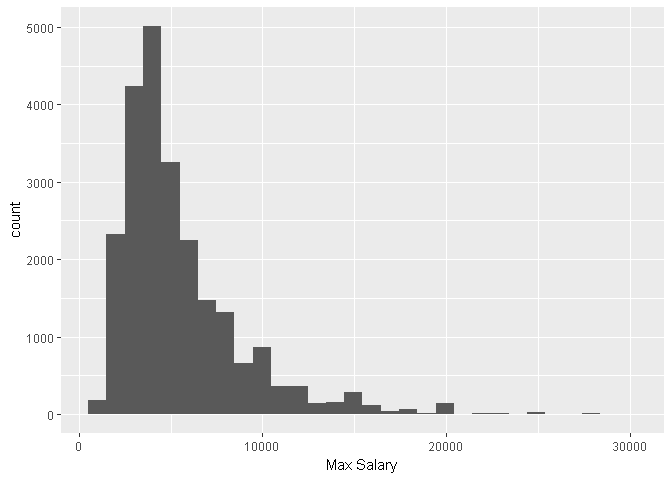
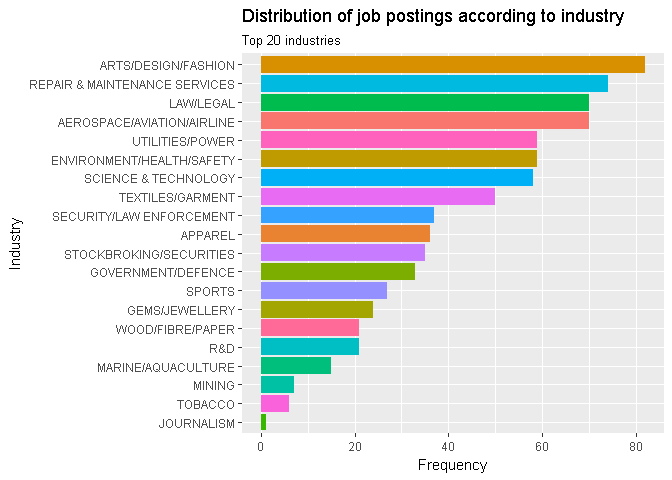
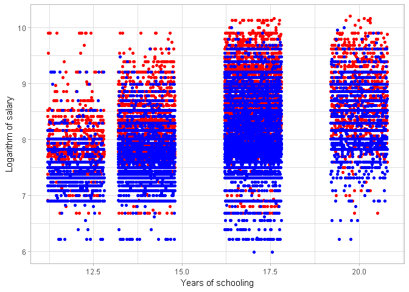
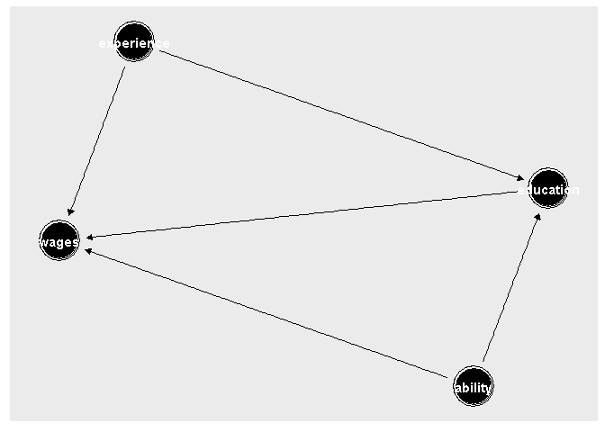

## The data 
* 26895 job postings between 20th November 2017 and 26th January 2018 
* Features: Job description, maximum and minimum salary, date posted


## How does the data look like? 

```r
colnames(Data)
```

```
##  [1] "Title"                "Company"              "Company Registration"
##  [4] "Industry"             "Description"          "Experience"          
##  [7] "Benefits"             "Language"             "Working Hours"       
## [10] "Company Size"         "Dress Code"           "Company Description" 
## [13] "Why Join?"            "Address"              "Location"            
## [16] "Website"              "Phone"                "Date Posted"         
## [19] "Min Salary"           "Max Salary"           "Date"
```

```r
Data$Description[1]
```

```
## [1] "BENEFITS: MEDICAL INSURANCE COVERAGE\n \nREQUIREMENTS:\n\nMIN 2 YEARS OF SALES EXPERIENCE AND INDUSTRY SUPPLY.\nDIPLOMA / DEGREE IN SALES OR MECHANICAL OR ANY FIELD OF ENGINEERING.\nGOOD COMMAND OF ORAL AND WRITTEN ENGLISH & MANDARIN.\nABLE TO WORK INDEPENDENTLY, AGGRESSIVE AND SELF-STARTER.\nGOOD INTERPERSONAL, P.R SKILL AND COMMUNICATION SKILL.\nPOSSESS OWN TRANSPORT AND ABLE TO TRAVELING.\n\n \nRESPONSIBILITIES:\n\nRESPONSIBLE TO PROMOTE AND SELL THE COMPANY’S RANGE OF PRODUCT AND SERVICES\nTO HANDLE / SERVICE EXISTING CUSTOMER AND DEVELOP/EXPAND NEW CUSTOMER BASE\nTO HANDLE ANY AD HOCK TASK AS AND WHEN ASSIGNED BY MANAGER\n\n\n \nSHIN-YO ENGINEERING SDN BHD (510968-K)\nNO. 86, JALAN MEGA MENDUNG, BANDAR PARK\nOFF JALAN KELANG LAMA, 58200 KUALA LUMPUR\nTEL: 03-7984 8401 EXT: 28 OR 26 OR 012-7980 263"
```

### How do our job titles look like? 

```r
library("RColorBrewer")
library("wordcloud")
library("SnowballC")
library("tm")
```

```
## Loading required package: NLP
```

```
## 
## Attaching package: 'NLP'
```

```
## The following object is masked from 'package:ggplot2':
## 
##     annotate
```

```r
toSpace <- content_transformer(function (x , pattern ) gsub(pattern, " ", x))

Data$Title %>% 
  iconv("latin1", "ASCII", sub="") %>% # remove Chinese and othe non-ASCII characters
  VectorSource %>% 
  Corpus %>%
  tm_map(toSpace, "/") %>% 
  tm_map(toSpace, "@") %>% 
  tm_map(toSpace, "\\|") %>% 
  tm_map(content_transformer(tolower)) %>% 
  tm_map(removeNumbers) %>% 
  tm_map(removeWords, stopwords("english")) %>% 
  tm_map(removePunctuation) %>% 
  tm_map(stripWhitespace) %>% 
  TermDocumentMatrix %>%
  as.matrix %>% 
  rowSums %>% 
  sort(decreasing=TRUE) -> v 

d <- data.frame(word = names(v), freq=v)
head(d, 10)
```

```
##                word freq
## executive executive 5863
## manager     manager 4669
## sales         sales 3462
## engineer   engineer 2854
## assistant assistant 2625
## senior       senior 2448
## marketing marketing 1281
## accounts   accounts 1188
## service     service 1148
## customer   customer 1105
```

```r
wordcloud(words = d$word, freq = d$freq, min.freq = 1,
          max.words=200, random.order=FALSE, rot.per=0.35, 
          colors=brewer.pal(8, "Dark2"))
```

<!-- -->

## Creating dummies for education

```r
rec <- recipe(Data) %>%
  step_regex(Description, pattern = "(PRIMARY SCHOOL|HIGHER SECONDARY|SPM)", result = "ed.school") %>%
  step_regex(Description, pattern = "(STPM|DIPLOMA|CERTIFICATE)", result = "ed.preu") %>% 
  step_regex(Description, pattern = "(BACHELOR|DEGREE)", result = "ed.bach") %>%
  step_regex(Description, pattern = "(MASTER|POSTGRADUATE DIPLOMA|PHD|DOCTORATE|DOCTOR|POST-DOC)", result = "ed.post") 

rec2 <- prep(rec, training = Data)
with_dummies <- bake(rec2, newdata = Data)
```

## Imputing years of schooling


```r
with_dummies$schooling <- ifelse(with_dummies$ed.post == 1, 20, 
                           ifelse(with_dummies$ed.bach == 1, 17, 
                                  ifelse(with_dummies$ed.preu == 1, 14, 
                                         ifelse(with_dummies$ed.school == 1, 12, 0))))

with_dummies[with_dummies$schooling == 0, 'schooling']<- NA
```

## Distribution of max salaries between 1000-30000
* It's possible that salaries are not denominated in MYR, hence data subsetted to only contain Malaysian postings
 

```r
jobsmy <- with_dummies %>% 
  filter(grepl('MALAYSIA', Location))
```


```r
ggplot(jobsmy[jobsmy$`Max Salary`<30000 & jobsmy$`Max Salary`>1000,],aes(`Max Salary`)) + geom_histogram()
```

```
## `stat_bin()` using `bins = 30`. Pick better value with `binwidth`.
```

<!-- -->

## Salaries data is obviously skewed 
therefore take the logarithm of salaries to obtain a roughly normal distribution


```r
jobsmy$lmax <- log(jobsmy$`Max Salary`)
```

```
## Warning in log(jobsmy$`Max Salary`): NaNs produced
```

```r
jobsmy$lmin <- log(jobsmy$`Min Salary`)
```

```
## Warning in log(jobsmy$`Min Salary`): NaNs produced
```

```r
ggplot(jobsmy,aes(lmax)) + geom_histogram()
```

```
## `stat_bin()` using `bins = 30`. Pick better value with `binwidth`.
```

```
## Warning: Removed 477 rows containing non-finite values (stat_bin).
```

<!-- -->
## Eliminate outliers 
* getting rid of observations with zmax 3 standard deviations above mean 
* Any experience above 10 years is assumed to be junk data 

```r
jobsmy$zmax <- abs(scale(jobsmy$lmax))
jobsmy[jobsmy$zmax > 3 & !is.na(jobsmy$zmax),'lmax'] <- NA

jobsmy[jobsmy$Experience > 10 & !is.na(jobsmy$Experience),'Experience'] <- NA
```


```r
skimr::skim(jobsmy) %>% skimr::kable(type = 'html')
```

```
## Skim summary statistics  
##  n obs: 24160    
##  n variables: 29    
## 
## Variable type: character
## 
## variable   missing   complete   n       min   max   empty   n_unique 
## ---------  --------  ---------  ------  ----  ----  ------  ---------
## zmax       0         24160      24160   3     19    0       340      
## 
## Variable type: Date
## 
## variable   missing   complete   n       min          max          median       n_unique 
## ---------  --------  ---------  ------  -----------  -----------  -----------  ---------
## Date       0         24160      24160   2017-11-20   2018-01-26   2018-01-15   35       
## 
## Variable type: factor
## 
## variable               missing   complete   n       n_unique   top_counts                                   ordered 
## ---------------------  --------  ---------  ------  ---------  -------------------------------------------  --------
## Address                5386      18774      24160   9454       NA: 5386, LEV: 198, MEN: 174, LEV: 107       FALSE   
## Benefits               5576      18584      24160   2844       NA: 5576, MED: 2642, MED: 1470, MED: 477     FALSE   
## Company                0         24160      24160   8282       COM: 886, COM: 408, REE: 354, HAY: 287       FALSE   
## Company Description    200       23960      24160   9708       REE: 350, AS : 229, NA: 200, AT : 138        FALSE   
## Company Registration   1751      22409      24160   7873       NA: 1751, 111: 354, 955: 287, 972: 229       FALSE   
## Company Size           1288      22872      24160   8          1 -: 7930, 51 : 5859, 201: 2758, MOR: 1850   FALSE   
## Date Posted            0         24160      24160   35         25-: 1761, 26-: 1470, 19-: 1324, 22-: 1284   FALSE   
## Description            0         24160      24160   23517      YOU: 14, YOU: 13, SAL: 11, ACQ: 9            FALSE   
## Dress Code             5161      18999      24160   477        BUS: 9177, NA: 5161, FOR: 3345, CAS: 2515    FALSE   
## Industry               1283      22877      24160   59         MAN: 2650, HUM: 2488, BAN: 1375, NA: 1283    FALSE   
## Language               4996      19164      24160   387        ENG: 14671, NA: 4996, CHI: 1237, MAL: 417    FALSE   
## Location               0         24160      24160   4639       MAL: 3630, MAL: 1481, MAL: 696, MAL: 672     FALSE   
## Phone                  9220      14940      24160   6192       NA: 9220, 03-: 229, +60: 173, 603: 133       FALSE   
## Title                  0         24160      24160   16695      SAL: 360, ACC: 254, MAR: 154, GRA: 115       FALSE   
## Website                10140     14020      24160   5127       NA: 10140, HTT: 173, HTT: 133, HTT: 123      FALSE   
## Why Join?              6474      17686      24160   6401       NA: 6474, WE : 229, WE : 201, WE : 143       FALSE   
## Working Hours          5092      19068      24160   1602       REG: 12769, NA: 5092, SAT: 992, 24/: 229     FALSE   
## 
## Variable type: numeric
## 
## variable     missing   complete   n       mean       sd        p0         p25    p50    p75    p100      hist     
## -----------  --------  ---------  ------  ---------  --------  ---------  -----  -----  -----  --------  ---------
## ed.bach      0         24160      24160   0.6        0.49      0          0      1      1      1         <U+2586><U+2581><U+2581><U+2581><U+2581><U+2581><U+2581><U+2587> 
## ed.post      0         24160      24160   0.065      0.25      0          0      0      0      1         <U+2587><U+2581><U+2581><U+2581><U+2581><U+2581><U+2581><U+2581> 
## ed.preu      0         24160      24160   0.58       0.49      0          0      1      1      1         <U+2586><U+2581><U+2581><U+2581><U+2581><U+2581><U+2581><U+2587> 
## ed.school    0         24160      24160   0.15       0.35      0          0      0      0      1         <U+2587><U+2581><U+2581><U+2581><U+2581><U+2581><U+2581><U+2582> 
## Experience   3685      20475      24160   2.99       2.09      1          1      2      4      10        <U+2587><U+2583><U+2581><U+2582><U+2581><U+2581><U+2581><U+2581> 
## lmax         699       23461      24160   8.41       0.56      6.67       8.01   8.34   8.78   10.2      <U+2581><U+2581><U+2583><U+2587><U+2586><U+2583><U+2581><U+2581> 
## lmin         477       23683      24160   8.03       0.6       2.56       7.6    8.01   8.41   16.81     <U+2581><U+2581><U+2586><U+2587><U+2581><U+2581><U+2581><U+2581> 
## Max Salary   0         24160      24160   -1.8e+17   1.3e+18   -9.2e+18   3000   4200   6500   2.5e+07   <U+2581><U+2581><U+2581><U+2581><U+2581><U+2581><U+2581><U+2587> 
## Min Salary   0         24160      24160   -1.8e+17   1.3e+18   -9.2e+18   2000   3000   4100   2e+07     <U+2581><U+2581><U+2581><U+2581><U+2581><U+2581><U+2581><U+2587> 
## schooling    3197      20963      24160   16.2       1.93      12         14     17     17     20        <U+2581><U+2583><U+2581><U+2581><U+2587><U+2581><U+2581><U+2581>
```

<!-- -->

<!-- -->

<!-- -->


```r
ggplot(jobsmy[jobsmy$lmax > 6,]) + 
  geom_jitter(aes(schooling, lmax), color = 'red') + 
  geom_jitter(aes(schooling, lmin), color = 'blue') + 
  xlab('Years of schooling') + ylab('Logarithm of salary') +
  scale_color_discrete(labels = c('Maximum', 'Minimum')) + theme_light()
```

<!-- -->

# Can we do better? 
* Correlation between schooling and wages doesn't tell anything about whether an additional year of schooling provides additional wages. 
* Older people have the potential to obtain more years of education, and people with greater ability naturally self-select into higher degrees and higher-paying jobs. 
* This confounding means that the observed correlation does not have a causal interpretation. The confounding effect can be eliminated by controlling for confounders in a regression.


```
## 
## Attaching package: 'ggdag'
```

```
## The following object is masked from 'package:stats':
## 
##     filter
```

<!-- -->

## Mincer wage regression 
- The Mincer wage regression is given by log wages ~ education + experience + experience^2
- We estimate the returns to education using the cleaned education and experience data
- ability is not observed, so we just control for years of experience: 


```r
library(estimatr)
```

```
## 
## Attaching package: 'estimatr'
```

```
## The following object is masked from 'package:broom':
## 
##     tidy
```

```r
jobsmy[is.na(jobsmy$Experience), 'Experience'] <- mean(jobsmy$Experience, na.rm = TRUE)
jobsmy$exp2 <- jobsmy$Experience ^ 2 
mincer <- lm_robust(lmax~schooling+Experience+exp2, data = jobsmy)
summary(mincer)
```

```
## 
## Call:
## lm_robust(formula = lmax ~ schooling + Experience + exp2, data = jobsmy)
## 
## Standard error type:  HC2 
## 
## Coefficients:
##              Estimate Std. Error   Pr(>|t|)  CI Lower CI Upper    DF
## (Intercept)  6.575260   0.026375  0.000e+00  6.523564  6.62696 20513
## schooling    0.084358   0.001654  0.000e+00  0.081116  0.08760 20513
## Experience   0.163510   0.004459 3.322e-285  0.154770  0.17225 20513
## exp2        -0.002071   0.000485  1.961e-05 -0.003021 -0.00112 20513
## 
## Multiple R-squared:  0.4301 ,	Adjusted R-squared:   0.43 
## F-statistic:  5160 on 3 and 20513 DF,  p-value: < 2.2e-16
```

```r
paste('We estimate a', round(mincer$coefficients[2]*100,2), '% increase in wages from an extra year of education. Does this make sense?')
```

```
## [1] "We estimate a 8.44 % increase in wages from an extra year of education. Does this make sense?"
```
