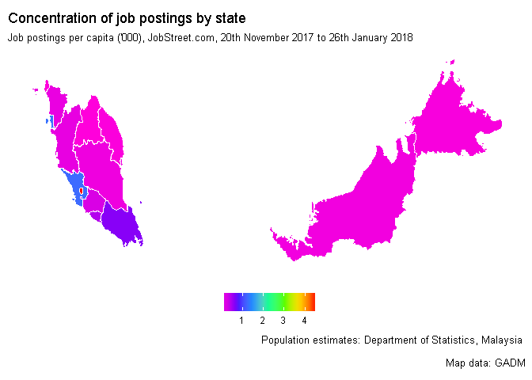
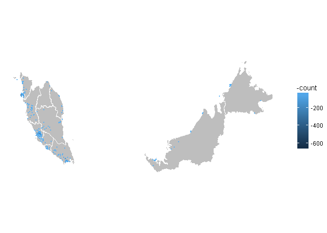

## The data 
* 26895 job postings between 20th November 2017 and 26th January 2018 
* Features: Job description, maximum and minimum salary, date posted


## How does the data look like? 

```r
colnames(Data)
```

```
##  [1] "Title"                "Company"              "Company Registration"
##  [4] "Industry"             "Description"          "Experience"          
##  [7] "Benefits"             "Language"             "Working Hours"       
## [10] "Company Size"         "Dress Code"           "Company Description" 
## [13] "Why Join?"            "Address"              "Location"            
## [16] "Website"              "Phone"                "Date Posted"         
## [19] "Min Salary"           "Max Salary"           "Date"
```

```r
Data$Description[1]
```

```
## [1] "BENEFITS: MEDICAL INSURANCE COVERAGE\n \nREQUIREMENTS:\n\nMIN 2 YEARS OF SALES EXPERIENCE AND INDUSTRY SUPPLY.\nDIPLOMA / DEGREE IN SALES OR MECHANICAL OR ANY FIELD OF ENGINEERING.\nGOOD COMMAND OF ORAL AND WRITTEN ENGLISH & MANDARIN.\nABLE TO WORK INDEPENDENTLY, AGGRESSIVE AND SELF-STARTER.\nGOOD INTERPERSONAL, P.R SKILL AND COMMUNICATION SKILL.\nPOSSESS OWN TRANSPORT AND ABLE TO TRAVELING.\n\n \nRESPONSIBILITIES:\n\nRESPONSIBLE TO PROMOTE AND SELL THE COMPANY’S RANGE OF PRODUCT AND SERVICES\nTO HANDLE / SERVICE EXISTING CUSTOMER AND DEVELOP/EXPAND NEW CUSTOMER BASE\nTO HANDLE ANY AD HOCK TASK AS AND WHEN ASSIGNED BY MANAGER\n\n\n \nSHIN-YO ENGINEERING SDN BHD (510968-K)\nNO. 86, JALAN MEGA MENDUNG, BANDAR PARK\nOFF JALAN KELANG LAMA, 58200 KUALA LUMPUR\nTEL: 03-7984 8401 EXT: 28 OR 26 OR 012-7980 263"
```

### How do our job titles look like? 

```r
library("RColorBrewer")
library("wordcloud")
library("SnowballC")
library("tm")

toSpace <- content_transformer(function (x , pattern ) gsub(pattern, " ", x))

Data$Title %>% 
  iconv("latin1", "ASCII", sub="") %>% # remove Chinese and othe non-ASCII characters
  VectorSource %>% 
  Corpus %>%
  tm_map(toSpace, "/") %>% 
  tm_map(toSpace, "@") %>% 
  tm_map(toSpace, "\\|") %>% 
  tm_map(content_transformer(tolower)) %>% 
  tm_map(removeNumbers) %>% 
  tm_map(removeWords, stopwords("english")) %>% 
  tm_map(removePunctuation) %>% 
  tm_map(stripWhitespace) %>% 
  TermDocumentMatrix %>%
  as.matrix %>% 
  rowSums %>% 
  sort(decreasing=TRUE) -> v 

d <- data.frame(word = names(v), freq=v)
head(d, 10)
```

```
##                word freq
## executive executive 5863
## manager     manager 4669
## sales         sales 3462
## engineer   engineer 2854
## assistant assistant 2625
## senior       senior 2448
## marketing marketing 1281
## accounts   accounts 1188
## service     service 1148
## customer   customer 1105
```

```r
wordcloud(words = d$word, freq = d$freq, min.freq = 1,
          max.words=200, random.order=FALSE, rot.per=0.35, 
          colors=brewer.pal(8, "Dark2"))
```

<!-- -->

### Where are the jobs? 


```r
Data[substr(Data$Location, 1, 8) == 'MALAYSIA',] -> v
v %>% 
  filter(grepl('MALAYSIA', Location)) %>% 
  dplyr::select(Location) %>%  as.matrix %>% str_squish %>% str_trim %>%
  table %>% as.data.frame -> v 

separate(v, col = ., into = c('location.a', 'location.b', 'location.c'), 
           sep = "\\-") %>% 
  group_by(location.b) %>% 
  summarise(Freq = sum(Freq)) -> v2

v2$location.b <- str_trim(v2$location.b)
v2 %>% group_by(location.b) %>% summarise(Freq = sum(Freq)) -> v2
v2$location.b  <- replace(v2$location.b, grepl("PENANG", v2$location.b), "PULAU PINANG")
v2$location.b  <- replace(v2$location.b, grepl("TERENGGANU", v2$location.b), "TRENGGANU")

v2[!grepl('TESTING', v2$location.b),] -> v3
v3$location.b <- str_to_title(v3$location.b)

population <- read_excel("population.xlsx", range = "A5:B22")
gsub("W.P. ", "", population$States) %>% str_trim %>% str_to_title -> population$location.b
population$location.b <- replace(population$location.b, grepl("Terengganu", population$location.b), "Trengganu")
population <- population[population$location.b != 'MALAYSIA',]

# ignore multiple locations, jobs outside Malaysia. 
library(raster)
myslevel1 <- getData('GADM', country='MYS', level=1)
# myslevel1 <- readRDS("MYS_adm1.rds")
myslevel1@data <- left_join(myslevel1@data, v3, by = c("NAME_1" = 'location.b'))

data_frame(id=rownames(myslevel1@data), state=myslevel1@data$NAME_1) %>% 
  left_join(v3, by = c("state" = 'location.b')) %>% 
  left_join(population, by = c("state" = "location.b")) -> locationdf

locationdf$jobsperthousand <- locationdf$Freq/locationdf$Total
```


```r
library(ggmap)
map <- fortify(myslevel1)
final_map <- left_join(map, locationdf)


final_map1 <- filter(final_map, state == "Kuala Lumpur" | state == 'Putrajaya')
final_map2 <- filter(final_map, state != "Kuala Lumpur" & state != 'Putrajaya')
```


```r
ggplot() + geom_polygon(aes(x = final_map2$long, y = final_map2$lat, 
                            group = final_map2$group, 
                            fill = final_map2$jobsperthousand), 
                        color = 'white') + 
  geom_polygon(aes(x = final_map1$long, y = final_map1$lat, 
                            group = final_map1$group, fill = final_map1$jobsperthousand), 
               color = 'white') +  
  coord_fixed(1.3) + theme_bw() + 
    scale_fill_gradientn(colours = rev(rainbow(7))) + 
  labs(title = "Concentration of job postings by state", 
       subtitle = "Job postings per capita ('000), JobStreet.com, 20th November 2017 to 26th January 2018",
        caption = "Population estimates: Department of Statistics, Malaysia \n
        Map data: GADM") + 
  theme(legend.title = element_blank(),
        legend.position = 'bottom',
        axis.text = element_blank(),
        axis.line = element_blank(),
        axis.ticks = element_blank(),
        panel.border = element_blank(),
        panel.grid = element_blank(),
        axis.title = element_blank()) 
```

<!-- -->

```r
remove(final_map1, final_map2)
```
## Simple scatter of jobs using postcode 

```r
postcode <- read_csv('my_postal_codes.csv') # source geocodes.com
Data$postcode <- stringi::stri_extract_last_regex(Data$Address, "\\d{5}")
Data %>% 
  filter(!is.na(postcode)) %>% 
  group_by(postcode) %>% 
  summarise(count=n()) %>% 
  left_join(postcode, by = c('postcode' = 'Postal Code'), all.x = TRUE, all.y = FALSE) -> Data2
```


```r
ggplot() + geom_polygon(data = final_map, aes(x = long, y = lat, group = group), 
                        color = 'white', fill = 'grey') + 
  geom_point(data = Data2, aes(x = Longitude, y = Latitude, color = -count), size = .1) + theme_nothing(legend = TRUE) + coord_fixed(1.3)
```

<!-- -->

```r
rm(final_map)
```

## Creating dummies for education

```r
rec <- recipe(Data) %>%
  step_regex(Description, pattern = "(PRIMARY SCHOOL|HIGHER SECONDARY|SPM)", result = "ed.school") %>%
  step_regex(Description, pattern = "(STPM|DIPLOMA|CERTIFICATE)", result = "ed.preu") %>% 
  step_regex(Description, pattern = "(BACHELOR|DEGREE)", result = "ed.bach") %>%
  step_regex(Description, pattern = "(MASTER|POSTGRADUATE DIPLOMA|PHD|DOCTORATE|DOCTOR|POST-DOC)", result = "ed.post") 

rec2 <- prep(rec, training = Data)
with_dummies <- bake(rec2, newdata = Data)
```

## Imputing years of schooling


```r
with_dummies$schooling <- ifelse(with_dummies$ed.post == 1, 20, 
                           ifelse(with_dummies$ed.bach == 1, 17, 
                                  ifelse(with_dummies$ed.preu == 1, 14, 
                                         ifelse(with_dummies$ed.school == 1, 12, 0))))

with_dummies[with_dummies$schooling == 0, 'schooling']<- NA
```

## Distribution of max salaries between 1000-30000
* It's possible that salaries are not denominated in MYR, hence data subsetted to only contain Malaysian postings
 

```r
jobsmy <- with_dummies %>% 
  filter(grepl('MALAYSIA', Location))
```


```r
ggplot(jobsmy[jobsmy$`Max Salary`<30000 & jobsmy$`Max Salary`>1000,],aes(`Max Salary`)) + geom_histogram()
```

```
## `stat_bin()` using `bins = 30`. Pick better value with `binwidth`.
```

<!-- -->

## Salaries data is obviously skewed 
therefore take the logarithm of salaries to obtain a roughly normal distribution


```r
jobsmy$lmax <- log(jobsmy$`Max Salary`)
jobsmy$lmin <- log(jobsmy$`Min Salary`)
ggplot(jobsmy,aes(lmax)) + geom_histogram()
```

<!-- -->

## Eliminate outliers 
* getting rid of observations with zmax 3 standard deviations above mean 
* Any experience above 10 years is assumed to be junk data 

```r
jobsmy$zmax <- abs(scale(jobsmy$lmax))
jobsmy[jobsmy$zmax > 3 & !is.na(jobsmy$zmax),'lmax'] <- NA

jobsmy[jobsmy$Experience > 10 & !is.na(jobsmy$Experience),'Experience'] <- NA
```


```r
skimr::skim(jobsmy) %>% skimr::kable(format = 'html')
```

Skim summary statistics  
 n obs: 24160    
 n variables: 30    

Variable type: character<table>
 <thead>
  <tr>
   <th style="text-align:left;"> variable </th>
   <th style="text-align:left;"> missing </th>
   <th style="text-align:left;"> complete </th>
   <th style="text-align:left;"> n </th>
   <th style="text-align:left;"> min </th>
   <th style="text-align:left;"> max </th>
   <th style="text-align:left;"> empty </th>
   <th style="text-align:left;"> n_unique </th>
  </tr>
 </thead>
<tbody>
  <tr>
   <td style="text-align:left;"> zmax </td>
   <td style="text-align:left;"> 0 </td>
   <td style="text-align:left;"> 24160 </td>
   <td style="text-align:left;"> 24160 </td>
   <td style="text-align:left;"> 3 </td>
   <td style="text-align:left;"> 19 </td>
   <td style="text-align:left;"> 0 </td>
   <td style="text-align:left;"> 340 </td>
  </tr>
</tbody>
</table>

Variable type: Date<table>
 <thead>
  <tr>
   <th style="text-align:left;"> variable </th>
   <th style="text-align:left;"> missing </th>
   <th style="text-align:left;"> complete </th>
   <th style="text-align:left;"> n </th>
   <th style="text-align:left;"> min </th>
   <th style="text-align:left;"> max </th>
   <th style="text-align:left;"> median </th>
   <th style="text-align:left;"> n_unique </th>
  </tr>
 </thead>
<tbody>
  <tr>
   <td style="text-align:left;"> Date </td>
   <td style="text-align:left;"> 0 </td>
   <td style="text-align:left;"> 24160 </td>
   <td style="text-align:left;"> 24160 </td>
   <td style="text-align:left;"> 2017-11-20 </td>
   <td style="text-align:left;"> 2018-01-26 </td>
   <td style="text-align:left;"> 2018-01-15 </td>
   <td style="text-align:left;"> 35 </td>
  </tr>
</tbody>
</table>

Variable type: factor<table>
 <thead>
  <tr>
   <th style="text-align:left;"> variable </th>
   <th style="text-align:left;"> missing </th>
   <th style="text-align:left;"> complete </th>
   <th style="text-align:left;"> n </th>
   <th style="text-align:left;"> n_unique </th>
   <th style="text-align:left;"> top_counts </th>
   <th style="text-align:left;"> ordered </th>
  </tr>
 </thead>
<tbody>
  <tr>
   <td style="text-align:left;"> Address </td>
   <td style="text-align:left;"> 5386 </td>
   <td style="text-align:left;"> 18774 </td>
   <td style="text-align:left;"> 24160 </td>
   <td style="text-align:left;"> 9454 </td>
   <td style="text-align:left;"> NA: 5386, LEV: 198, MEN: 174, LEV: 107 </td>
   <td style="text-align:left;"> FALSE </td>
  </tr>
  <tr>
   <td style="text-align:left;"> Benefits </td>
   <td style="text-align:left;"> 5576 </td>
   <td style="text-align:left;"> 18584 </td>
   <td style="text-align:left;"> 24160 </td>
   <td style="text-align:left;"> 2844 </td>
   <td style="text-align:left;"> NA: 5576, MED: 2642, MED: 1470, MED: 477 </td>
   <td style="text-align:left;"> FALSE </td>
  </tr>
  <tr>
   <td style="text-align:left;"> Company </td>
   <td style="text-align:left;"> 0 </td>
   <td style="text-align:left;"> 24160 </td>
   <td style="text-align:left;"> 24160 </td>
   <td style="text-align:left;"> 8282 </td>
   <td style="text-align:left;"> COM: 886, COM: 408, REE: 354, HAY: 287 </td>
   <td style="text-align:left;"> FALSE </td>
  </tr>
  <tr>
   <td style="text-align:left;"> Company Description </td>
   <td style="text-align:left;"> 200 </td>
   <td style="text-align:left;"> 23960 </td>
   <td style="text-align:left;"> 24160 </td>
   <td style="text-align:left;"> 9708 </td>
   <td style="text-align:left;"> REE: 350, AS : 229, NA: 200, AT : 138 </td>
   <td style="text-align:left;"> FALSE </td>
  </tr>
  <tr>
   <td style="text-align:left;"> Company Registration </td>
   <td style="text-align:left;"> 1751 </td>
   <td style="text-align:left;"> 22409 </td>
   <td style="text-align:left;"> 24160 </td>
   <td style="text-align:left;"> 7873 </td>
   <td style="text-align:left;"> NA: 1751, 111: 354, 955: 287, 972: 229 </td>
   <td style="text-align:left;"> FALSE </td>
  </tr>
  <tr>
   <td style="text-align:left;"> Company Size </td>
   <td style="text-align:left;"> 1288 </td>
   <td style="text-align:left;"> 22872 </td>
   <td style="text-align:left;"> 24160 </td>
   <td style="text-align:left;"> 8 </td>
   <td style="text-align:left;"> 1 -: 7930, 51 : 5859, 201: 2758, MOR: 1850 </td>
   <td style="text-align:left;"> FALSE </td>
  </tr>
  <tr>
   <td style="text-align:left;"> Date Posted </td>
   <td style="text-align:left;"> 0 </td>
   <td style="text-align:left;"> 24160 </td>
   <td style="text-align:left;"> 24160 </td>
   <td style="text-align:left;"> 35 </td>
   <td style="text-align:left;"> 25-: 1761, 26-: 1470, 19-: 1324, 22-: 1284 </td>
   <td style="text-align:left;"> FALSE </td>
  </tr>
  <tr>
   <td style="text-align:left;"> Description </td>
   <td style="text-align:left;"> 0 </td>
   <td style="text-align:left;"> 24160 </td>
   <td style="text-align:left;"> 24160 </td>
   <td style="text-align:left;"> 23517 </td>
   <td style="text-align:left;"> YOU: 14, YOU: 13, SAL: 11, ACQ: 9 </td>
   <td style="text-align:left;"> FALSE </td>
  </tr>
  <tr>
   <td style="text-align:left;"> Dress Code </td>
   <td style="text-align:left;"> 5161 </td>
   <td style="text-align:left;"> 18999 </td>
   <td style="text-align:left;"> 24160 </td>
   <td style="text-align:left;"> 477 </td>
   <td style="text-align:left;"> BUS: 9177, NA: 5161, FOR: 3345, CAS: 2515 </td>
   <td style="text-align:left;"> FALSE </td>
  </tr>
  <tr>
   <td style="text-align:left;"> Industry </td>
   <td style="text-align:left;"> 1283 </td>
   <td style="text-align:left;"> 22877 </td>
   <td style="text-align:left;"> 24160 </td>
   <td style="text-align:left;"> 59 </td>
   <td style="text-align:left;"> MAN: 2650, HUM: 2488, BAN: 1375, NA: 1283 </td>
   <td style="text-align:left;"> FALSE </td>
  </tr>
  <tr>
   <td style="text-align:left;"> Language </td>
   <td style="text-align:left;"> 4996 </td>
   <td style="text-align:left;"> 19164 </td>
   <td style="text-align:left;"> 24160 </td>
   <td style="text-align:left;"> 387 </td>
   <td style="text-align:left;"> ENG: 14671, NA: 4996, CHI: 1237, MAL: 417 </td>
   <td style="text-align:left;"> FALSE </td>
  </tr>
  <tr>
   <td style="text-align:left;"> Location </td>
   <td style="text-align:left;"> 0 </td>
   <td style="text-align:left;"> 24160 </td>
   <td style="text-align:left;"> 24160 </td>
   <td style="text-align:left;"> 4639 </td>
   <td style="text-align:left;"> MAL: 3630, MAL: 1481, MAL: 696, MAL: 672 </td>
   <td style="text-align:left;"> FALSE </td>
  </tr>
  <tr>
   <td style="text-align:left;"> Phone </td>
   <td style="text-align:left;"> 9220 </td>
   <td style="text-align:left;"> 14940 </td>
   <td style="text-align:left;"> 24160 </td>
   <td style="text-align:left;"> 6192 </td>
   <td style="text-align:left;"> NA: 9220, 03-: 229, +60: 173, 603: 133 </td>
   <td style="text-align:left;"> FALSE </td>
  </tr>
  <tr>
   <td style="text-align:left;"> postcode </td>
   <td style="text-align:left;"> 11915 </td>
   <td style="text-align:left;"> 12245 </td>
   <td style="text-align:left;"> 24160 </td>
   <td style="text-align:left;"> 444 </td>
   <td style="text-align:left;"> NA: 11915, 119: 669, 592: 514, 504: 369 </td>
   <td style="text-align:left;"> FALSE </td>
  </tr>
  <tr>
   <td style="text-align:left;"> Title </td>
   <td style="text-align:left;"> 0 </td>
   <td style="text-align:left;"> 24160 </td>
   <td style="text-align:left;"> 24160 </td>
   <td style="text-align:left;"> 16695 </td>
   <td style="text-align:left;"> SAL: 360, ACC: 254, MAR: 154, GRA: 115 </td>
   <td style="text-align:left;"> FALSE </td>
  </tr>
  <tr>
   <td style="text-align:left;"> Website </td>
   <td style="text-align:left;"> 10140 </td>
   <td style="text-align:left;"> 14020 </td>
   <td style="text-align:left;"> 24160 </td>
   <td style="text-align:left;"> 5127 </td>
   <td style="text-align:left;"> NA: 10140, HTT: 173, HTT: 133, HTT: 123 </td>
   <td style="text-align:left;"> FALSE </td>
  </tr>
  <tr>
   <td style="text-align:left;"> Why Join? </td>
   <td style="text-align:left;"> 6474 </td>
   <td style="text-align:left;"> 17686 </td>
   <td style="text-align:left;"> 24160 </td>
   <td style="text-align:left;"> 6401 </td>
   <td style="text-align:left;"> NA: 6474, WE : 229, WE : 201, WE : 143 </td>
   <td style="text-align:left;"> FALSE </td>
  </tr>
  <tr>
   <td style="text-align:left;"> Working Hours </td>
   <td style="text-align:left;"> 5092 </td>
   <td style="text-align:left;"> 19068 </td>
   <td style="text-align:left;"> 24160 </td>
   <td style="text-align:left;"> 1602 </td>
   <td style="text-align:left;"> REG: 12769, NA: 5092, SAT: 992, 24/: 229 </td>
   <td style="text-align:left;"> FALSE </td>
  </tr>
</tbody>
</table>

Variable type: numeric<table>
 <thead>
  <tr>
   <th style="text-align:left;"> variable </th>
   <th style="text-align:left;"> missing </th>
   <th style="text-align:left;"> complete </th>
   <th style="text-align:left;"> n </th>
   <th style="text-align:left;"> mean </th>
   <th style="text-align:left;"> sd </th>
   <th style="text-align:left;"> p0 </th>
   <th style="text-align:left;"> p25 </th>
   <th style="text-align:left;"> p50 </th>
   <th style="text-align:left;"> p75 </th>
   <th style="text-align:left;"> p100 </th>
   <th style="text-align:left;"> hist </th>
  </tr>
 </thead>
<tbody>
  <tr>
   <td style="text-align:left;"> ed.bach </td>
   <td style="text-align:left;"> 0 </td>
   <td style="text-align:left;"> 24160 </td>
   <td style="text-align:left;"> 24160 </td>
   <td style="text-align:left;"> 0.6 </td>
   <td style="text-align:left;"> 0.49 </td>
   <td style="text-align:left;"> 0 </td>
   <td style="text-align:left;"> 0 </td>
   <td style="text-align:left;"> 1 </td>
   <td style="text-align:left;"> 1 </td>
   <td style="text-align:left;"> 1 </td>
   <td style="text-align:left;"> <U+2586><U+2581><U+2581><U+2581><U+2581><U+2581><U+2581><U+2587> </td>
  </tr>
  <tr>
   <td style="text-align:left;"> ed.post </td>
   <td style="text-align:left;"> 0 </td>
   <td style="text-align:left;"> 24160 </td>
   <td style="text-align:left;"> 24160 </td>
   <td style="text-align:left;"> 0.065 </td>
   <td style="text-align:left;"> 0.25 </td>
   <td style="text-align:left;"> 0 </td>
   <td style="text-align:left;"> 0 </td>
   <td style="text-align:left;"> 0 </td>
   <td style="text-align:left;"> 0 </td>
   <td style="text-align:left;"> 1 </td>
   <td style="text-align:left;"> <U+2587><U+2581><U+2581><U+2581><U+2581><U+2581><U+2581><U+2581> </td>
  </tr>
  <tr>
   <td style="text-align:left;"> ed.preu </td>
   <td style="text-align:left;"> 0 </td>
   <td style="text-align:left;"> 24160 </td>
   <td style="text-align:left;"> 24160 </td>
   <td style="text-align:left;"> 0.58 </td>
   <td style="text-align:left;"> 0.49 </td>
   <td style="text-align:left;"> 0 </td>
   <td style="text-align:left;"> 0 </td>
   <td style="text-align:left;"> 1 </td>
   <td style="text-align:left;"> 1 </td>
   <td style="text-align:left;"> 1 </td>
   <td style="text-align:left;"> <U+2586><U+2581><U+2581><U+2581><U+2581><U+2581><U+2581><U+2587> </td>
  </tr>
  <tr>
   <td style="text-align:left;"> ed.school </td>
   <td style="text-align:left;"> 0 </td>
   <td style="text-align:left;"> 24160 </td>
   <td style="text-align:left;"> 24160 </td>
   <td style="text-align:left;"> 0.15 </td>
   <td style="text-align:left;"> 0.35 </td>
   <td style="text-align:left;"> 0 </td>
   <td style="text-align:left;"> 0 </td>
   <td style="text-align:left;"> 0 </td>
   <td style="text-align:left;"> 0 </td>
   <td style="text-align:left;"> 1 </td>
   <td style="text-align:left;"> <U+2587><U+2581><U+2581><U+2581><U+2581><U+2581><U+2581><U+2582> </td>
  </tr>
  <tr>
   <td style="text-align:left;"> Experience </td>
   <td style="text-align:left;"> 3685 </td>
   <td style="text-align:left;"> 20475 </td>
   <td style="text-align:left;"> 24160 </td>
   <td style="text-align:left;"> 2.99 </td>
   <td style="text-align:left;"> 2.09 </td>
   <td style="text-align:left;"> 1 </td>
   <td style="text-align:left;"> 1 </td>
   <td style="text-align:left;"> 2 </td>
   <td style="text-align:left;"> 4 </td>
   <td style="text-align:left;"> 10 </td>
   <td style="text-align:left;"> <U+2587><U+2583><U+2581><U+2582><U+2581><U+2581><U+2581><U+2581> </td>
  </tr>
  <tr>
   <td style="text-align:left;"> lmax </td>
   <td style="text-align:left;"> 699 </td>
   <td style="text-align:left;"> 23461 </td>
   <td style="text-align:left;"> 24160 </td>
   <td style="text-align:left;"> 8.41 </td>
   <td style="text-align:left;"> 0.56 </td>
   <td style="text-align:left;"> 6.67 </td>
   <td style="text-align:left;"> 8.01 </td>
   <td style="text-align:left;"> 8.34 </td>
   <td style="text-align:left;"> 8.78 </td>
   <td style="text-align:left;"> 10.2 </td>
   <td style="text-align:left;"> <U+2581><U+2581><U+2583><U+2587><U+2586><U+2583><U+2581><U+2581> </td>
  </tr>
  <tr>
   <td style="text-align:left;"> lmin </td>
   <td style="text-align:left;"> 477 </td>
   <td style="text-align:left;"> 23683 </td>
   <td style="text-align:left;"> 24160 </td>
   <td style="text-align:left;"> 8.03 </td>
   <td style="text-align:left;"> 0.6 </td>
   <td style="text-align:left;"> 2.56 </td>
   <td style="text-align:left;"> 7.6 </td>
   <td style="text-align:left;"> 8.01 </td>
   <td style="text-align:left;"> 8.41 </td>
   <td style="text-align:left;"> 16.81 </td>
   <td style="text-align:left;"> <U+2581><U+2581><U+2586><U+2587><U+2581><U+2581><U+2581><U+2581> </td>
  </tr>
  <tr>
   <td style="text-align:left;"> Max Salary </td>
   <td style="text-align:left;"> 0 </td>
   <td style="text-align:left;"> 24160 </td>
   <td style="text-align:left;"> 24160 </td>
   <td style="text-align:left;"> -1.8e+17 </td>
   <td style="text-align:left;"> 1.3e+18 </td>
   <td style="text-align:left;"> -9.2e+18 </td>
   <td style="text-align:left;"> 3000 </td>
   <td style="text-align:left;"> 4200 </td>
   <td style="text-align:left;"> 6500 </td>
   <td style="text-align:left;"> 2.5e+07 </td>
   <td style="text-align:left;"> <U+2581><U+2581><U+2581><U+2581><U+2581><U+2581><U+2581><U+2587> </td>
  </tr>
  <tr>
   <td style="text-align:left;"> Min Salary </td>
   <td style="text-align:left;"> 0 </td>
   <td style="text-align:left;"> 24160 </td>
   <td style="text-align:left;"> 24160 </td>
   <td style="text-align:left;"> -1.8e+17 </td>
   <td style="text-align:left;"> 1.3e+18 </td>
   <td style="text-align:left;"> -9.2e+18 </td>
   <td style="text-align:left;"> 2000 </td>
   <td style="text-align:left;"> 3000 </td>
   <td style="text-align:left;"> 4100 </td>
   <td style="text-align:left;"> 2e+07 </td>
   <td style="text-align:left;"> <U+2581><U+2581><U+2581><U+2581><U+2581><U+2581><U+2581><U+2587> </td>
  </tr>
  <tr>
   <td style="text-align:left;"> schooling </td>
   <td style="text-align:left;"> 3197 </td>
   <td style="text-align:left;"> 20963 </td>
   <td style="text-align:left;"> 24160 </td>
   <td style="text-align:left;"> 16.2 </td>
   <td style="text-align:left;"> 1.93 </td>
   <td style="text-align:left;"> 12 </td>
   <td style="text-align:left;"> 14 </td>
   <td style="text-align:left;"> 17 </td>
   <td style="text-align:left;"> 17 </td>
   <td style="text-align:left;"> 20 </td>
   <td style="text-align:left;"> <U+2581><U+2583><U+2581><U+2581><U+2587><U+2581><U+2581><U+2581> </td>
  </tr>
</tbody>
</table>

<!-- -->

<!-- -->

<!-- -->


```r
ggplot(jobsmy[jobsmy$lmax > 6,]) + 
  geom_jitter(aes(schooling, lmax), color = 'red') + 
  geom_jitter(aes(schooling, lmin), color = 'blue') + 
  xlab('Years of schooling') + ylab('Logarithm of salary') +
  scale_color_discrete(labels = c('Maximum', 'Minimum')) + theme_light()
```

<!-- -->

# Can we do better? 
* Correlation between schooling and wages doesn't tell anything about whether an additional year of schooling provides additional wages. 
* Older people have the potential to obtain more years of education, and people with greater ability naturally self-select into higher degrees and higher-paying jobs. 
* This confounding means that the observed correlation does not have a causal interpretation. The confounding effect can be eliminated by controlling for confounders in a regression.

<!-- -->

## Mincer wage regression 
- The Mincer wage regression is given by log wages ~ education + experience + experience^2
- We estimate the returns to education using the cleaned education and experience data
- ability is not observed, so we just control for years of experience: 


```r
library(estimatr)
```

```
## 
## Attaching package: 'estimatr'
```

```
## The following object is masked from 'package:broom':
## 
##     tidy
```

```r
jobsmy[is.na(jobsmy$Experience), 'Experience'] <- mean(jobsmy$Experience, na.rm = TRUE)
jobsmy$exp2 <- jobsmy$Experience ^ 2 
mincer <- lm_robust(lmax~schooling+Experience+exp2, data = jobsmy)
summary(mincer)
```

```
## 
## Call:
## lm_robust(formula = lmax ~ schooling + Experience + exp2, data = jobsmy)
## 
## Standard error type:  HC2 
## 
## Coefficients:
##              Estimate Std. Error   Pr(>|t|)  CI Lower CI Upper    DF
## (Intercept)  6.575260   0.026375  0.000e+00  6.523564  6.62696 20513
## schooling    0.084358   0.001654  0.000e+00  0.081116  0.08760 20513
## Experience   0.163510   0.004459 3.322e-285  0.154770  0.17225 20513
## exp2        -0.002071   0.000485  1.961e-05 -0.003021 -0.00112 20513
## 
## Multiple R-squared:  0.4301 ,	Adjusted R-squared:   0.43 
## F-statistic:  5160 on 3 and 20513 DF,  p-value: < 2.2e-16
```

```r
paste('We estimate a', round(mincer$coefficients[2]*100,2), '% increase in wages from an extra year of education. Does this make sense?')
```

```
## [1] "We estimate a 8.44 % increase in wages from an extra year of education. Does this make sense?"
```
