```r
library(readr)
library(tidyverse)

production <- read_csv("~/eda_r/human_resource/production_staff.csv")
core <- read_csv("~/eda_r/human_resource/core_dataset.csv")
HR <- read_csv("~/eda_r/human_resource/HRDataset_v9.csv")
core <- core[1:nrow(core)-1,]
```

## Data Description

* *Data*: Human Resource: Core dataset
* *Observations*: 302
* *Objective*: Pay rate


# Data cleaning

## Missing values

```r
sapply(core, function(x) sum(is.na(x))) %>%
  sort(decreasing = TRUE) %>% 
  knitr::kable(format = 'html') 
```

<table>
 <thead>
  <tr>
   <th style="text-align:left;">   </th>
   <th style="text-align:right;"> x </th>
  </tr>
 </thead>
<tbody>
  <tr>
   <td style="text-align:left;"> Date of Termination </td>
   <td style="text-align:right;"> 198 </td>
  </tr>
  <tr>
   <td style="text-align:left;"> Employee Name </td>
   <td style="text-align:right;"> 0 </td>
  </tr>
  <tr>
   <td style="text-align:left;"> Employee Number </td>
   <td style="text-align:right;"> 0 </td>
  </tr>
  <tr>
   <td style="text-align:left;"> State </td>
   <td style="text-align:right;"> 0 </td>
  </tr>
  <tr>
   <td style="text-align:left;"> Zip </td>
   <td style="text-align:right;"> 0 </td>
  </tr>
  <tr>
   <td style="text-align:left;"> DOB </td>
   <td style="text-align:right;"> 0 </td>
  </tr>
  <tr>
   <td style="text-align:left;"> Age </td>
   <td style="text-align:right;"> 0 </td>
  </tr>
  <tr>
   <td style="text-align:left;"> Sex </td>
   <td style="text-align:right;"> 0 </td>
  </tr>
  <tr>
   <td style="text-align:left;"> MaritalDesc </td>
   <td style="text-align:right;"> 0 </td>
  </tr>
  <tr>
   <td style="text-align:left;"> CitizenDesc </td>
   <td style="text-align:right;"> 0 </td>
  </tr>
  <tr>
   <td style="text-align:left;"> Hispanic/Latino </td>
   <td style="text-align:right;"> 0 </td>
  </tr>
  <tr>
   <td style="text-align:left;"> RaceDesc </td>
   <td style="text-align:right;"> 0 </td>
  </tr>
  <tr>
   <td style="text-align:left;"> Date of Hire </td>
   <td style="text-align:right;"> 0 </td>
  </tr>
  <tr>
   <td style="text-align:left;"> Reason For Term </td>
   <td style="text-align:right;"> 0 </td>
  </tr>
  <tr>
   <td style="text-align:left;"> Employment Status </td>
   <td style="text-align:right;"> 0 </td>
  </tr>
  <tr>
   <td style="text-align:left;"> Department </td>
   <td style="text-align:right;"> 0 </td>
  </tr>
  <tr>
   <td style="text-align:left;"> Position </td>
   <td style="text-align:right;"> 0 </td>
  </tr>
  <tr>
   <td style="text-align:left;"> Pay Rate </td>
   <td style="text-align:right;"> 0 </td>
  </tr>
  <tr>
   <td style="text-align:left;"> Manager Name </td>
   <td style="text-align:right;"> 0 </td>
  </tr>
  <tr>
   <td style="text-align:left;"> Employee Source </td>
   <td style="text-align:right;"> 0 </td>
  </tr>
  <tr>
   <td style="text-align:left;"> Performance Score </td>
   <td style="text-align:right;"> 0 </td>
  </tr>
</tbody>
</table>

## Text issues 
* male -> Male 
* Software engineering: extra space

## Age


```r
core %>% 
  group_by(Age) %>%
  summarise(count = n()) %>%
  ggplot(aes(x = Age, y = count, fill = factor(Age))) + geom_bar(stat = 'identity') + 
  ggtitle('Distribution of Ages among Employees') + theme(legend.position = 'none')
```

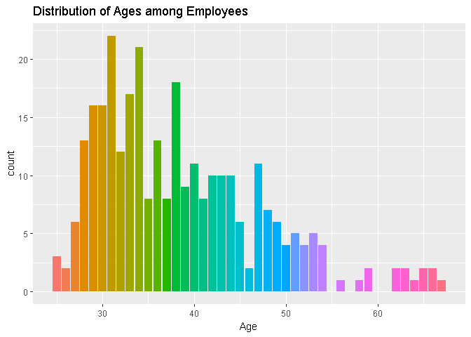<!-- -->

# Gender

```r
core$Sex <- gsub('\\<male\\>', 'Male', core$Sex)

core %>% 
  group_by(Sex) %>% 
  summarise(wage = mean(`Pay Rate`)) %>% 
  ggplot(aes(x = Sex, y = wage, fill = Sex)) + geom_bar(stat = 'identity') + 
  theme(legend.position = 'none')
```

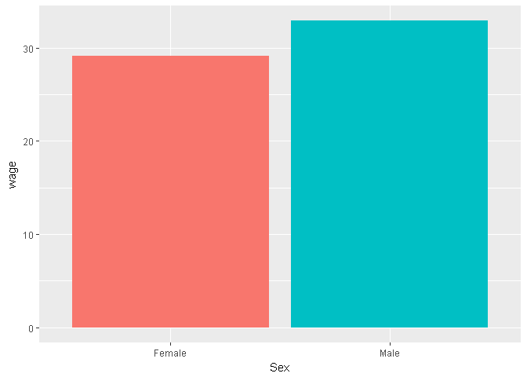<!-- -->


```r
core %>% 
  group_by(Sex) %>% 
  summarise(wage = mean(`Pay Rate`)) %>% 
  knitr::kable(format = 'html')
```

<table>
 <thead>
  <tr>
   <th style="text-align:left;"> Sex </th>
   <th style="text-align:right;"> wage </th>
  </tr>
 </thead>
<tbody>
  <tr>
   <td style="text-align:left;"> Female </td>
   <td style="text-align:right;"> 29.11678 </td>
  </tr>
  <tr>
   <td style="text-align:left;"> Male </td>
   <td style="text-align:right;"> 32.90528 </td>
  </tr>
</tbody>
</table>

# Race

```r
core %>% 
  group_by(RaceDesc) %>% 
  summarise(wage = mean(`Pay Rate`)) %>% 
  ggplot(aes(x = RaceDesc, y = wage, fill = RaceDesc)) + geom_bar(stat = 'identity') + 
  theme(legend.position = 'none') + xlab('Race')
```

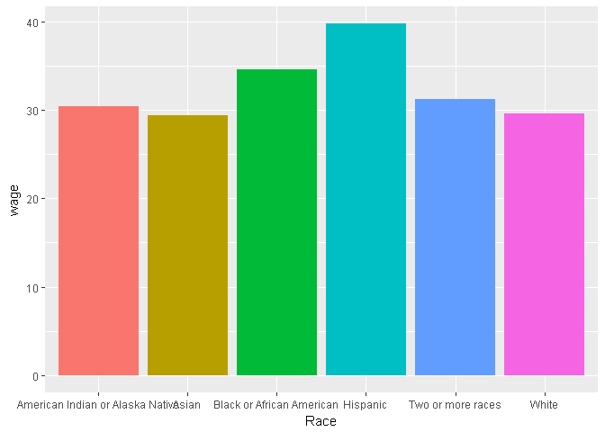<!-- -->


```r
core %>% 
  group_by(RaceDesc) %>% 
  summarise(wage = mean(`Pay Rate`)) %>% 
  knitr::kable(format = 'html')
```

<table>
 <thead>
  <tr>
   <th style="text-align:left;"> RaceDesc </th>
   <th style="text-align:right;"> wage </th>
  </tr>
 </thead>
<tbody>
  <tr>
   <td style="text-align:left;"> American Indian or Alaska Native </td>
   <td style="text-align:right;"> 30.37500 </td>
  </tr>
  <tr>
   <td style="text-align:left;"> Asian </td>
   <td style="text-align:right;"> 29.44065 </td>
  </tr>
  <tr>
   <td style="text-align:left;"> Black or African American </td>
   <td style="text-align:right;"> 34.62463 </td>
  </tr>
  <tr>
   <td style="text-align:left;"> Hispanic </td>
   <td style="text-align:right;"> 39.75000 </td>
  </tr>
  <tr>
   <td style="text-align:left;"> Two or more races </td>
   <td style="text-align:right;"> 31.26444 </td>
  </tr>
  <tr>
   <td style="text-align:left;"> White </td>
   <td style="text-align:right;"> 29.57705 </td>
  </tr>
</tbody>
</table>

# Group by sex, race

* *Females* and *African-Americans* have higher pay rate
* *Males* and *Hispanics* have higher pay rate

Top three earning races by gender: 


```r
core %>% 
  group_by(Sex, RaceDesc) %>% 
  summarise(av.wage = mean(`Pay Rate`), av.age = mean(`Age`)) %>% 
  top_n(3, wt = av.wage) %>% 
  knitr::kable(format = 'html')
```

<table>
 <thead>
  <tr>
   <th style="text-align:left;"> Sex </th>
   <th style="text-align:left;"> RaceDesc </th>
   <th style="text-align:right;"> av.wage </th>
   <th style="text-align:right;"> av.age </th>
  </tr>
 </thead>
<tbody>
  <tr>
   <td style="text-align:left;"> Female </td>
   <td style="text-align:left;"> Asian </td>
   <td style="text-align:right;"> 26.85550 </td>
   <td style="text-align:right;"> 39.80000 </td>
  </tr>
  <tr>
   <td style="text-align:left;"> Female </td>
   <td style="text-align:left;"> Black or African American </td>
   <td style="text-align:right;"> 34.38367 </td>
   <td style="text-align:right;"> 39.96667 </td>
  </tr>
  <tr>
   <td style="text-align:left;"> Female </td>
   <td style="text-align:left;"> White </td>
   <td style="text-align:right;"> 28.65182 </td>
   <td style="text-align:right;"> 38.20000 </td>
  </tr>
  <tr>
   <td style="text-align:left;"> Male </td>
   <td style="text-align:left;"> American Indian or Alaska Native </td>
   <td style="text-align:right;"> 36.00000 </td>
   <td style="text-align:right;"> 38.50000 </td>
  </tr>
  <tr>
   <td style="text-align:left;"> Male </td>
   <td style="text-align:left;"> Hispanic </td>
   <td style="text-align:right;"> 47.33333 </td>
   <td style="text-align:right;"> 36.00000 </td>
  </tr>
  <tr>
   <td style="text-align:left;"> Male </td>
   <td style="text-align:left;"> Two or more races </td>
   <td style="text-align:right;"> 40.46571 </td>
   <td style="text-align:right;"> 42.42857 </td>
  </tr>
</tbody>
</table>


# Department

```r
core %>% 
  group_by(Department) %>% 
  summarise(wage = mean(`Pay Rate`)) %>% 
  ggplot(aes(x = Department, y = wage, fill = Department)) + geom_bar(stat = 'identity') + 
  theme(legend.position = 'none')
```

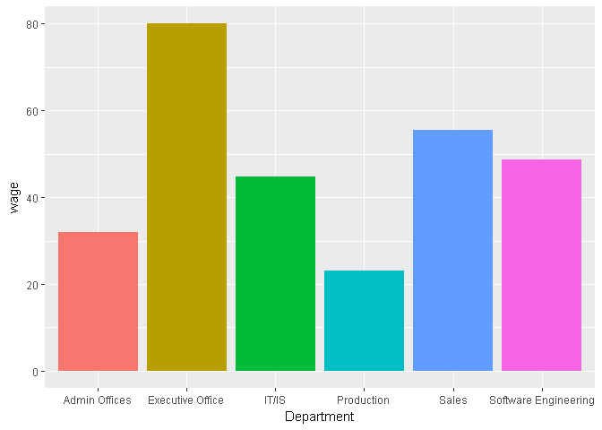<!-- -->

Average wage by department: 

```r
core %>% 
  group_by(Department) %>% 
  summarise(wage = mean(`Pay Rate`)) %>% 
  knitr::kable(format = 'html')
```

<table>
 <thead>
  <tr>
   <th style="text-align:left;"> Department </th>
   <th style="text-align:right;"> wage </th>
  </tr>
 </thead>
<tbody>
  <tr>
   <td style="text-align:left;"> Admin Offices </td>
   <td style="text-align:right;"> 31.89600 </td>
  </tr>
  <tr>
   <td style="text-align:left;"> Executive Office </td>
   <td style="text-align:right;"> 80.00000 </td>
  </tr>
  <tr>
   <td style="text-align:left;"> IT/IS </td>
   <td style="text-align:right;"> 44.79220 </td>
  </tr>
  <tr>
   <td style="text-align:left;"> Production </td>
   <td style="text-align:right;"> 23.08630 </td>
  </tr>
  <tr>
   <td style="text-align:left;"> Sales </td>
   <td style="text-align:right;"> 55.52419 </td>
  </tr>
  <tr>
   <td style="text-align:left;"> Software Engineering </td>
   <td style="text-align:right;"> 48.66500 </td>
  </tr>
</tbody>
</table>

# Group by department, position
Top two earning positions (on average) in each department: 

```r
core %>% 
  group_by(Department, Position) %>% 
  summarise(wage = mean(`Pay Rate`)) %>% 
  top_n(n=2, wt = wage) %>%
  knitr::kable(format = 'html')
```

<table>
 <thead>
  <tr>
   <th style="text-align:left;"> Department </th>
   <th style="text-align:left;"> Position </th>
   <th style="text-align:right;"> wage </th>
  </tr>
 </thead>
<tbody>
  <tr>
   <td style="text-align:left;"> Admin Offices </td>
   <td style="text-align:left;"> Shared Services Manager </td>
   <td style="text-align:right;"> 55.00000 </td>
  </tr>
  <tr>
   <td style="text-align:left;"> Admin Offices </td>
   <td style="text-align:left;"> Sr. Accountant </td>
   <td style="text-align:right;"> 34.95000 </td>
  </tr>
  <tr>
   <td style="text-align:left;"> Executive Office </td>
   <td style="text-align:left;"> President &amp; CEO </td>
   <td style="text-align:right;"> 80.00000 </td>
  </tr>
  <tr>
   <td style="text-align:left;"> IT/IS </td>
   <td style="text-align:left;"> CIO </td>
   <td style="text-align:right;"> 65.00000 </td>
  </tr>
  <tr>
   <td style="text-align:left;"> IT/IS </td>
   <td style="text-align:left;"> IT Director </td>
   <td style="text-align:right;"> 65.00000 </td>
  </tr>
  <tr>
   <td style="text-align:left;"> Production </td>
   <td style="text-align:left;"> Director of Operations </td>
   <td style="text-align:right;"> 60.00000 </td>
  </tr>
  <tr>
   <td style="text-align:left;"> Production </td>
   <td style="text-align:left;"> Production Manager </td>
   <td style="text-align:right;"> 49.67857 </td>
  </tr>
  <tr>
   <td style="text-align:left;"> Sales </td>
   <td style="text-align:left;"> Director of Sales </td>
   <td style="text-align:right;"> 60.00000 </td>
  </tr>
  <tr>
   <td style="text-align:left;"> Sales </td>
   <td style="text-align:left;"> Sales Manager </td>
   <td style="text-align:right;"> 56.75000 </td>
  </tr>
  <tr>
   <td style="text-align:left;"> Software Engineering </td>
   <td style="text-align:left;"> Software Engineer </td>
   <td style="text-align:right;"> 51.07222 </td>
  </tr>
  <tr>
   <td style="text-align:left;"> Software Engineering </td>
   <td style="text-align:left;"> Software Engineering Manager </td>
   <td style="text-align:right;"> 27.00000 </td>
  </tr>
</tbody>
</table>

Top-earning persons for each department: 
 - *Admin Offices*: Shared Services Manager
 - *Executive Office*: President & CEO
 - *IT/IS*: CIO, IT Director
 - *Production*: Director of Operations
 - *Sales*: Director of Sales
 - *Software Engineering*: Software Engineer

## Recruitment tools 

 * Sales seems to rely heavily on PPC recruitment - but perhaps recruits are keen to show that they are familiar with marketing tools
 * Production has the largest proportion in practically every employee source - but note that Production is also the largest department. 
 

```r
core %>% 
  group_by(Department) %>% 
  summarise(count = n()) %>% 
  ggplot(aes(Department, count, fill = Department)) + geom_bar(stat = 'identity') + theme(legend.position = 'none')
```

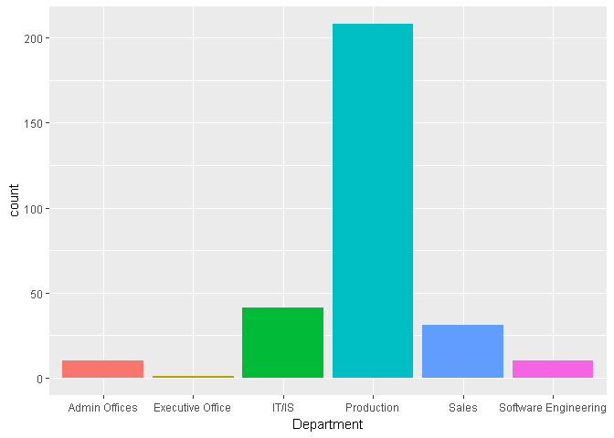<!-- -->


```r
core$`Employee Source` <- gsub('Pay Per Click - Google|Website Banner Ads', 
                               'Pay Per Click', core$`Employee Source`)
core$`Employee Source` <- gsub('Search Engine - Google Bing Yahoo', 
                               'Internet Search', core$`Employee Source`)
core$`Employee Source` <- gsub('Monster.com|Glassdoor|Careerbuilder', 
                               'Job Sites', core$`Employee Source`)
core$`Employee Source` <- gsub('Newspager/Magazine', 'Newspaper/Magazine', 
                               core$`Employee Source`)
core$`Employee Source` <- gsub('Company Intranet - Partner|Information Session|On-line Web application', 'Other', core$`Employee Source`)

table(core$`Employee Source`, core$Department) %>%
  as.data.frame %>%
  ggplot(aes(x = Var1, y = Freq, fill = Var2)) + geom_bar(stat = 'identity') +
  coord_flip() + labs(x = 'Employee Source', fill = 'Department')
```

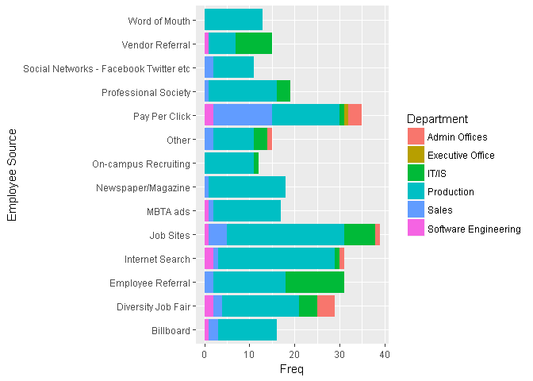<!-- -->

## Distribution of pay rates
 * We group people according to their level in the organisation: executives, seniors/managers and others
 * This approximately matches the distribution. 


```r
core$NewPosition <- NA
core[grepl(pattern = 'Director|CIO|CEO', x = core$Position),'NewPosition'] <- 'Executives'
core[grepl(pattern = 'Sr.|Manager', x = core$Position),'NewPosition'] <- 'Senior/Manager'

core[is.na(core$NewPosition), 'NewPosition'] <- 'Others'

ggplot(core, aes(`Pay Rate`, fill = NewPosition)) + geom_histogram() + labs(fill = 'Position group')
```

```
## `stat_bin()` using `bins = 30`. Pick better value with `binwidth`.
```

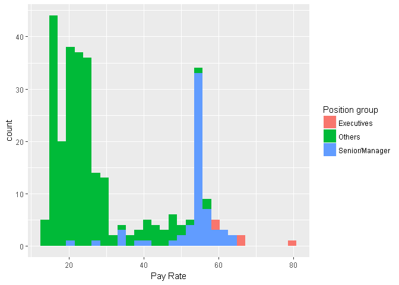<!-- -->

## Is there a statistically significant difference in the average pay of males and females?
* Yes. The difference in means is 3.8 and is significant at the 5% level. 


```r
lmtest::coeftest(lm(`Pay Rate`~factor(Sex), data = core))
```

```
## 
## t test of coefficients:
## 
##                 Estimate Std. Error t value Pr(>|t|)    
## (Intercept)      29.1168     1.1467 25.3925  < 2e-16 ***
## factor(Sex)Male   3.7885     1.7653  2.1461  0.03267 *  
## ---
## Signif. codes:  0 '***' 0.001 '**' 0.01 '*' 0.05 '.' 0.1 ' ' 1
```


## Is there a difference in the distribution of pay between males and females? 

 * Doesn't seem to be much of a difference in the distribution for junior positions. 
 * Almost all execs are females, but there's a concentration of females among junior-level managers. 

```r
library(ggridges)
ggplot(core, aes(x = `Pay Rate`, y = Sex, fill = NewPosition)) + 
  geom_density_ridges() + labs('Position group')
```

```
## Picking joint bandwidth of 1.92
```

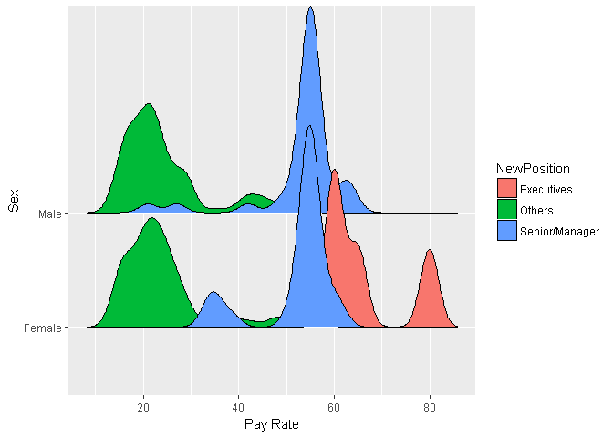<!-- -->


## Performance ratings

Is there gender disparity in how performance ratings are assigned? 


```r
ggplot(as.data.frame(table(core$Sex, core$`Performance Score`)), aes(x=Var1, y = Freq, fill = Var2)) + geom_bar(stat="identity") + labs(x = 'Sex', fill = 'Performance score')
```

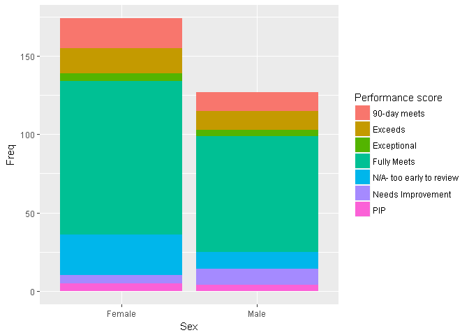<!-- -->


# Time to termination within Production
Looks like people who leave Production tend to leave very soon!

```r
production$`Date of Hire` <- as.Date(production$`Date of Hire`, '%m/%d/%Y')
production$`TermDate` <- as.Date(production$`TermDate`, '%m/%d/%Y')
production$TimeDiff <- production$TermDate - production$`Date of Hire` 
ggplot(production, aes(x = TimeDiff, fill= Position)) + geom_histogram() + labs(x = 'Time difference (days)')
```

```
## Don't know how to automatically pick scale for object of type difftime. Defaulting to continuous.
```

```
## `stat_bin()` using `bins = 30`. Pick better value with `binwidth`.
```

```
## Warning: Removed 173 rows containing non-finite values (stat_bin).
```

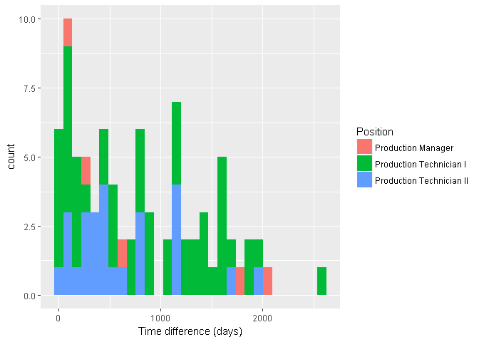<!-- -->

## Why do they leave? 

```r
production[!grepl(pattern = 'N/A',production$`Reason for Term`) & !is.na(production$`Reason for Term`),] %>% 
  group_by(`Reason for Term`) %>%
  summarise(Freq = n()) %>% 
  ggplot(aes(x = reorder(`Reason for Term`, Freq), y = Freq, fill = `Reason for Term`)) + 
  geom_bar(stat = 'identity') + coord_flip() + labs(x = 'Reason for Termination')
```

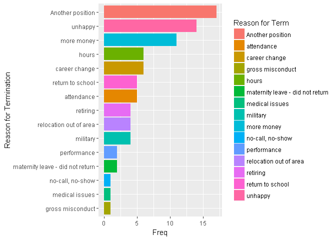<!-- -->

## Is it the pay rate? 
Most of production consists of junior positions. 

```r
core$prod = ifelse(core$Department == 'Production', 'Production', 'Not production')
ggplot(core, aes(x = `Pay Rate`, y = factor(prod), fill = NewPosition)) +
  ggridges::geom_density_ridges() + labs(fill = 'Position group') + 
  theme(axis.title.y = element_blank())
```

```
## Picking joint bandwidth of 2.14
```

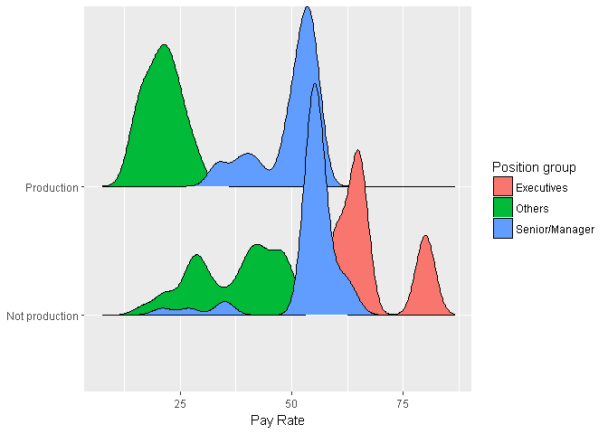<!-- -->

